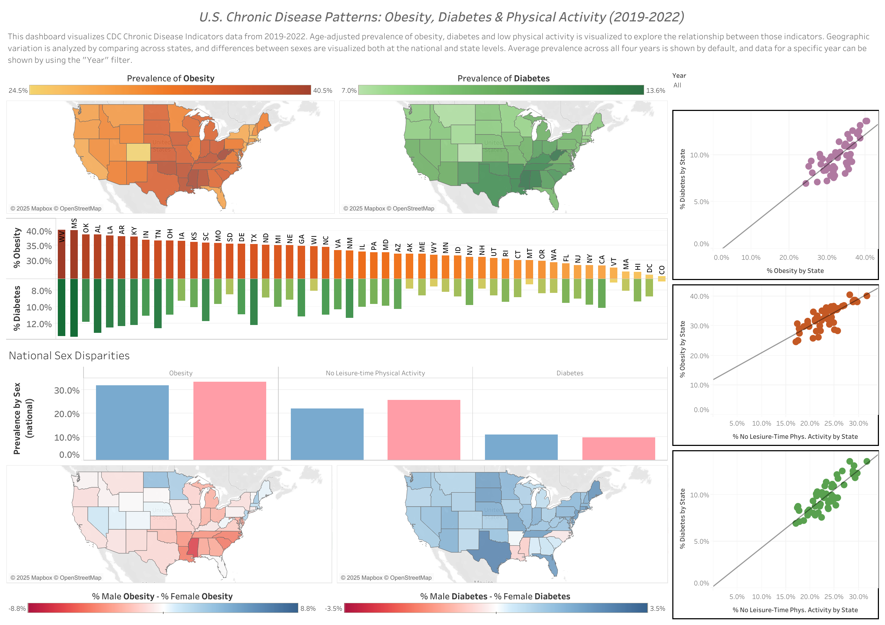

# U.S. Chronic Disease Patterns: Obesity, Diabetes & Physical Activity (2019-2022)



## Summary

This project examines age-adjusted prevalences of obesity, diabetes and low physical activity in the United States. Data was taken from the CDC Chronic Disease Indicators dataset and includes the years 2019 to 2022. SQL queries for exploring and processing the original dataset were executed locally using DuckDB, and visualizations of processed data were made using Tableau. The final dashboard aims to show geographic variation across states, disparities between sexes both at the state and national levels, and correlations between the indicators.

## Dashboard Access

The interactive dashboard can be viewed:

- **Online**: [Tableau Public](https://public.tableau.com/app/profile/daniel.de.oliveira4431/viz/cdi/cdi_dashboard)
- **Locally**: Open `tableau/cdi.twbx` in Tableau Desktop

## Project Structure

```text
cdc-chronic-disease-analysis/
│
├── data/
│   ├── raw/
│   │   └── cdi.csv
│   └── processed/
│       ├── state_obesity_diabetes.csv
│       ├── state_ob_di_by_sex.csv
│       ├── state_no_pa.csv
│       └── natl_indicators_by_sex.csv
│
├── sql/
│   ├── exploratory_queries.sql
│   └── analysis_queries.sql
│
├── tableau/
│   ├── cdi.twbx
│   └── cdi_dashboard.png
│
└── README.md
```

- `cdi.csv` is the original dataset.
- All data sets in the `data/processed/` directory result from running the queries in `analysis_queries.sql`.
- `exploratory_queries.sql` serves as a notebook and does not export any data.

## Reproducibility

Data processing can be done locally with DuckDB by running the command:

```bash
duckdb -init sql/analysis_queries.sql
```

Ensure that the working directory in which the command is run contains `data/raw/`, `data/processed/`, and `sql/` subdirectories and that `data/raw/cdi.csv` and `sql/analysis_queries.sql` exist.

## Key Findings

- The maps for prevalence of obesity and diabetes by state show a pattern of higher prevalence for both in the southern region.
- Mirrored bar charts and scatterplots indicate a strong positive relationship between obesity and diabetes prevalence across states.
- Despite correlation between obesity and diabetes, sex disparity maps show that higher obesity prevalence in women is more common, while higher diabetes prevalence in men is more common.
  - This may reflect behavioral, biological, or socioeconomic factors.
  - Could also be influenced by differences in physical activity as shown in the national-level bar chart.
- Prevalence of low physical activity is positively correlated with both obesity and diabetes prevalence.

## Technologies Used

- SQL ([DuckDB](https://duckdb.org))
- Tableau
- Git / GitHub
- [CDC Chronic Disease Indicators dataset](https://catalog.data.gov/dataset/u-s-chronic-disease-indicators)

## Future Improvements

- Compare prevalence by race/ethnicity
- Include race/ethnicity demographic data for states to explore its relation to obesity/diabetes prevalence
- Incorporate regional groupings

---

### Author

**Daniel De Oliveira** | [GitHub](https://github.com/danherbb) | [LinkedIn](https://www.linkedin.com/in/daniel-de-oliveira-0b50082b3/)
